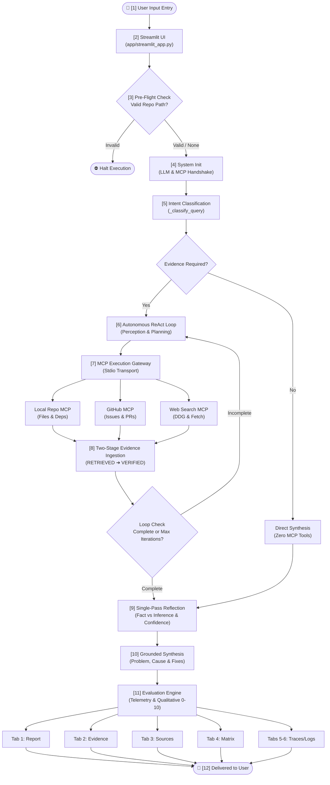

# System Architecture & Workflow Specification — AI Technical Research Investigator

## Executive Overview

The **AI Technical Research Investigator** is an agentic problem-solving framework engineered to investigate technical errors, version incompatibilities, dependency mismatches, and architectural inquiries across local codebases, package manifests, GitHub issues/discussions, and official web documentation.

The system is constructed around an autonomous **ReAct (Reason + Act) loop** backed by local (Ollama) or high-throughput cloud (Groq) Large Language Models, standard **Model Context Protocol (MCP)** tool servers executing over `stdio`, an evidence ingestion and two-tier verification engine, a single-pass reflection guardrail, and an empirical observability and telemetry suite rendered through a Streamlit UI.

---

## High-Level Architecture Flow Diagram

Below is the complete architectural flow diagram formatted with **horizontal lines and square nodes**, explicitly detailing what happens after each step in the system lifecycle:

```text
+==================================================================================================+
|                        AI TECHNICAL RESEARCH INVESTIGATOR — ARCHITECTURE FLOW                    |
+==================================================================================================+

                                    +-----------------------------+
                                    |     [1] USER INPUT ENTRY    |
                                    | Technical Query & Repo Path |
                                    +-----------------------------+
                                                   |
                                                   v
                                    +-----------------------------+
                                    |     [2] STREAMLIT WEB UI    |
                                    |   (app/streamlit_app.py)    |
                                    +-----------------------------+
                                                   |
                                                   v
                                    +-----------------------------+
                                    | [3] PRE-FLIGHT VALIDATION   |
                                    | Target Repo Path on Disk?   |
                                    +-----------------------------+
                                          /                 \
                          [Path Invalid] /                   \ [Valid or No Path]
                                        v                     v
                         +--------------------+    +-----------------------------+
                         | HALT EXECUTION     |    | [4] SYSTEM INITIALIZATION   |
                         | Display UI Error   |    | Connect LLM & Discover Tools|
                         +--------------------+    +-----------------------------+
                                                                  |
                                                                  v
                                                   +-----------------------------+
                                                   | [5] STRATEGIC CLASSIFICATION|
                                                   | Intent & Evidence Required? |
                                                   +-----------------------------+
                                                         /                 \
                                   [evidence_required=False]             [evidence_required=True]
                                       (General Concept)                 (Bug / Version / Repo)
                                                       /                     \
                                                      v                       v
                         +-------------------------------+  +------------------------------------+
                         | DIRECT SYNTHESIS PATH         |  | [6] AUTONOMOUS ReAct AGENT LOOP    |
                         | Fast Single LLM Response      |  | Perception -> Planning -> Tool Act |
                         | (Zero MCP Tool Calls)         |  | (app/agent/agent.py & planner.py)  |
                         +-------------------------------+  +------------------------------------+
                                         |                                    |
                                         |                                    v
                                         |                  +------------------------------------+
                                         |                  | [7] MCP TOOL EXECUTION GATEWAY     |
                                         |                  | Stdio Subprocess (JSON-RPC 2.0)    |
                                         |                  +------------------------------------+
                                         |                                    |
                                         |         +--------------------------+--------------------------+
                                         |         |                          |                          |
                                         |         v                          v                          v
                                         |  +--------------------+     +--------------------+     +--------------------+
                                         |  | LOCAL REPO MCP     |     | GITHUB ISSUES MCP  |     | WEB RESEARCH MCP   |
                                         |  | (repo_server.py)   |     | (github_server.py) |     | (web_search_server)|
                                         |  | Files, Dirs, Deps  |     | Search Issues & PRs|     | Web Search & Fetch |
                                         |  +--------------------+     +--------------------+     +--------------------+
                                         |         |                          |                          |
                                         |         +--------------------------+--------------------------+
                                         |                                    |
                                         |                                    v
                                         |                  +------------------------------------+
                                         |                  | [8] TWO-STAGE EVIDENCE INGESTION   |
                                         |                  | Status: RETRIEVED -> VERIFIED Gate |
                                         |                  | (app/evidence/manager.py)          |
                                         |                  +------------------------------------+
                                         |                                    |
                                         |                                    v
                                         |                  +------------------------------------+
                                         |                  | LOOP TERMINATION CHECK             |
                                         |                  | Information Complete or Max Limits?|
                                         |                  +------------------------------------+
                                         |                     |                              |
                                         |         [Incomplete & Iter < Max]        [Complete or Limit Hit]
                                         |                     |                              |
                                         |                     +-----> (Loop back to Step 6)  |
                                         |                                                    |
                                         +----------------------------+-----------------------+
                                                                      |
                                                                      v
                                                    +------------------------------------+
                                                    | [9] SINGLE-PASS REFLECTION ENGINE  |
                                                    | Fact vs Inference & Contradictions |
                                                    | (app/agent/reflection.py)          |
                                                    +------------------------------------+
                                                                      |
                                                                      v
                                                    +------------------------------------+
                                                    | [10] GROUNDED REPORT SYNTHESIS     |
                                                    | Problem, Root Cause, Remediation   |
                                                    | Evidence-to-Claim Mapping          |
                                                    +------------------------------------+
                                                                      |
                                                                      v
                                                    +------------------------------------+
                                                    | [11] EVALUATION & OBSERVABILITY    |
                                                    | Telemetry Matrix (Time, Latency)   |
                                                    | 5 Qualitative Scores (0.0 to 10.0) |
                                                    +------------------------------------+
                                                                      |
                    +--------------------+----------------------------+---------------------------+--------------------+
                    |                    |                            |                           |                    |
                    v                    v                            v                           v                    v
          +--------------------+ +--------------------+ +--------------------+     +--------------------+ +--------------------+
          | TAB 1: REPORT      | | TAB 2: EVIDENCE    | | TAB 3: SOURCES     |     | TAB 4: MATRIX      | | TABS 5 & 6: TRACES |
          | Final Diagnosis &  | | Verified Finding   | | Authoritative URLs |     | Measured Telemetry | | ReAct Decision Log |
          | Remediation Fixes  | | Cards & Badges     | | & Local File Paths |     | & Qualitative Grid | | & Execution Stream |
          +--------------------+ +--------------------+ +--------------------+     +--------------------+ +--------------------+
                    |                    |                            |                           |                    |
                    +--------------------+----------------------------+---------------------------+--------------------+
                                                                      |
                                                                      v
                                                    +------------------------------------+
                                                    | [12] COMPLETE & DELIVERED TO USER  |
                                                    | Interactive Multi-View Exploration |
                                                    +------------------------------------+
```

<details>
<summary><b>Click to expand Mermaid Graphical Flowchart (Interactive View)</b></summary>



</details>

---

## Detailed System Workflow (Step-by-Step)

The end-to-end operation progresses in strict sequential order, detailing **what happens after what**:

### Step 1 ➔ Step 2: Query Ingestion into Streamlit
- The user inputs a research question and an optional local repository path into the Streamlit UI ([`app/streamlit_app.py`](file:///c:/Users/ashmi/Downloads/L2_Project/L2_Project/app/streamlit_app.py)).
- Sidebar parameters (Target Model, Max Iterations, Max MCP Calls, Temperature) are bound to the execution session.

### Step 2 ➔ Step 3: Pre-Flight Repository Validation
- Before launching the agent, the system verifies whether `repo_path` points to a real directory on the local disk.
- **If invalid**: Execution halts immediately with an error banner; no agent cycles or tool calls are spawned.
- **If valid or omitted**: Control passes directly to System Initialization.

### Step 3 ➔ Step 4: System Initialization & MCP Handshake
- The agent initializes either [`GroqClient`](file:///c:/Users/ashmi/Downloads/L2_Project/L2_Project/app/llm/groq_client.py) (cloud) or [`OllamaClient`](file:///c:/Users/ashmi/Downloads/L2_Project/L2_Project/app/llm/ollama_client.py) (local).
- [`MCPClientManager`](file:///c:/Users/ashmi/Downloads/L2_Project/L2_Project/app/mcp/client.py) runs the discovery handshake (`initialize` ➔ `notifications/initialized` ➔ `tools/list`) with all configured server scripts over `stdio`.

### Step 4 ➔ Step 5: Strategic Intent Classification
- A deterministic regex scanner extracts signals (`has_temporal`, `has_investigation`, `has_repo`, `is_general_stable`).
- The LLM classifies the inquiry into an archetype:
  - **General Knowledge (`evidence_required = False`)**: Routes to Direct Synthesis.
  - **Investigation (`evidence_required = True`)**: Routes to the Autonomous ReAct Agent Loop.

### Step 5 ➔ Step 6: Autonomous ReAct Perception & Planning
- For local codebases, [`ReActPlanner`](file:///c:/Users/ashmi/Downloads/L2_Project/L2_Project/app/agent/planner.py) applies a deterministic inspection hierarchy (discover directory structure ➔ inspect dependencies ➔ check README ➔ inspect error logs ➔ inspect source files).
- For external queries, the LLM selects tools based on current observations and prompt context.
- Deduplication prevents repeating identical or >75% semantically duplicate tool calls.

### Step 6 ➔ Step 7: Stdio MCP Subprocess Execution
- Tool calls are dispatched over `stdio` subprocesses using JSON-RPC 2.0.
- Outgoing requests route to:
  - `repo_server.py`: AST search, dependency checks (`requirements.txt`, `pyproject.toml`), and directory listings.
  - `github_server.py`: Live GitHub REST API search for related issues and discussions.
  - `web_search_server.py`: DuckDuckGo search queries and URL text extractions (`fetch_web_document`).

### Step 7 ➔ Step 8: Evidence Ingestion & Verification
- Returned payloads are parsed into structured `EvidenceItem` records inside [`EvidenceManager`](file:///c:/Users/ashmi/Downloads/L2_Project/L2_Project/app/evidence/manager.py).
- Items enter as `RETRIEVED`. Only items corroborated by authoritative sources (official docs, local source code, or dependencies) advance to `VERIFIED`.

### Step 8 ➔ Step 6 (Loopback) or Step 9 (Reflection)
- **Loop Check**: If evidence is incomplete and `iteration < max_iterations`, execution loops back to **Step 6**.
- **Exit Condition**: If information is sufficient or safety limits are hit, execution advances to **Step 9**.

### Step 9 ➔ Step 10: Single-Pass Reflection Audit
- The [`ReflectionEngine`](file:///c:/Users/ashmi/Downloads/L2_Project/L2_Project/app/agent/reflection.py) audits findings against gathered evidence.
- Verifies fact vs. inference separation, checks for source contradictions, confirms evidence sufficiency, and assigns an authoritative confidence rating (`HIGH`, `MEDIUM`, or `LOW`).

### Step 10 ➔ Step 11: Grounded Report Synthesis
- The LLM drafts the final structured report strictly mapped to collected `EvidenceItem` IDs (`EVD-xxx`).
- Formats standard sections: Problem, Conclusion, Root Cause, Evidence-to-Claim Mapping, and Recommended Actions.

### Step 11 ➔ Step 12: Evaluation Matrix & Multi-View Delivery
- [`EvaluationEngine`](file:///c:/Users/ashmi/Downloads/L2_Project/L2_Project/app/evaluation/evaluator.py) computes measured telemetry (time, tokens, tool latencies) and 5 qualitative scores (Completeness, Quality, Relevance, Sufficiency, Efficiency).
- Streamlit renders results across the 6 specialized tabs:
  - `Tab 1: 📋 Investigation Report`
  - `Tab 2: 🔍 Grounded Evidence`
  - `Tab 3: 🌐 Verified Sources`
  - `Tab 4: 📊 Observability Matrix`
  - `Tab 5: 🛠️ Agent Activity & Traces`
  - `Tab 6: 📜 Execution Logs`

---

## Component Architecture

1. **Streamlit UI (`app/streamlit_app.py`)**: Modern tabbed interface with real-time event streaming and interactive sidebar.
2. **Agent Engine (`app/agent/`)**:
   - `agent.py`: Controls the primary ReAct perception-plan-act loop with safety counters.
   - `planner.py`: Deterministic repo navigator + LLM-driven external fallback.
   - `reflection.py`: Single-pass verification and confidence scoring.
3. **Model Context Protocol (MCP) Layer (`app/mcp/`)**: Stdio-based isolation for `repo_server`, `github_server`, and `web_search_server`.
4. **LLM Interface (`app/llm/`)**: Supports `OllamaClient` (local) and `GroqClient` (cloud).
5. **Observability**: Real-time `LogEvent` sink and empirical `EvaluationEngine`.

---

## Audit Safeguards & Reliability Guarantees

- **Pre-Execution Workspace Verification**: Path validation occurs before entry to prevent hallucinated local evidence.
- **Isolated MCP Stdio Transport**: Tools run in isolated subprocesses via JSON-RPC 2.0.
- **Two-Tier Verification Gate**: Evidence must be corroborated by authoritative sources to be promoted to `VERIFIED`.
- **Zero-Tool Knowledge Bypass**: Direct general knowledge questions bypass the tool loop entirely.
- **Call Signature Normalization**: Hashes (`tool_name:sorted_json_args`) are used to cache and prevent redundant tool invocations.
