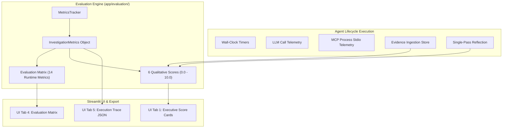

# Evaluation & Observability Framework

This document defines the empirical evaluation methodology, runtime telemetry pipeline, qualitative scoring algorithms, and automated test benchmark suite for the **AI Technical Research Investigator**.

---

## 1. Observability Architecture

The system avoids subjective, ungrounded assessments by computing all evaluation metrics directly from **real-time runtime telemetry** (wall-clock timers, token metadata, stdio process exit codes, and structured evidence stores).



---

## 2. Runtime Telemetry Fields (The 14 Metrics)

Every investigation dynamically captures 14 empirical telemetry parameters:

| Metric Name | Measurement Method | Unit | Description |
| :--- | :--- | :--- | :--- |
| **Total Investigation Time** | Wall-clock timer (`time.time()`) | Seconds | Total elapsed time from query receipt to final report rendering. |
| **LLM Calls** | Incremental counter per LLM completion | Count | Total requests sent to Ollama or Groq. |
| **Average LLM Latency** | Cumulative LLM time / total LLM calls | Seconds | Measures model inference responsiveness per step. |
| **Total Tokens** | Ollama `prompt_eval_count` + `eval_count` | Count | Exact token consumption across prompt and generation phases. |
| **Total MCP Calls** | Stdio tool execution counter | Count | Cumulative number of MCP tools invoked. |
| **Successful vs Failed Tool Calls** | Stdio response exit code / `isError` flag | Count | Differentiates successful executions from tool exceptions. |
| **Duplicate Calls Prevented** | In-memory tool signature cache hits | Count | Number of identical redundant tool calls short-circuited. |
| **Average Tool Latency** | Cumulative MCP time / total MCP calls | Seconds | Subprocess spawning and stdio JSON-RPC latency. |
| **Web Searches** | Per-tool execution counter (`search_web`) | Count | DuckDuckGo search queries executed. |
| **GitHub Searches** | Per-tool execution counter (`search_github_issues`) | Count | GitHub issue and PR queries executed. |
| **Repository Inspections** | Per-tool execution counter (`inspect_local_repository`) | Count | Local codebase file reads and dependency tree parses. |
| **Web Document Extractions** | Per-tool execution counter (`fetch_web_document`) | Count | Full web page HTML-to-markdown extractions. |
| **Evidence Items Collected** | Structured `EvidenceItem` store count | Count | Number of distinct, verified findings accumulated. |
| **Final Confidence** | Reflection Engine output | Percentage | Evidence-backed confidence score (0%–100%). |

---

## 3. Dynamic Evaluation Matrix

The `EvaluationEngine.generate_matrix()` function formats runtime telemetry into a structured table rendered directly in the Streamlit UI and test assertions:

```markdown
| Metric | Measured Value | Observation / Notes |
|---|---|---|
| Total Investigation Time | 3.45 sec | Wall clock duration |
| LLM Calls | 3 | Avg latency: 0.85s |
| Total Tokens | 1280 | Prompt: 890, Eval: 390 |
| Total MCP Calls | 2 | Success: 2, Fail: 0 |
| Duplicate Calls Prevented | 1 | Successful identical calls skipped |
| Average Tool Latency | 0.62 sec | Stdio transport execution latency |
| Web Searches | 1 | DuckDuckGo Search calls |
| GitHub Searches | 0 | GitHub Issues/PRs search calls |
| Repository Inspections | 1 | Local filesystem/code inspection calls |
| Web Document Extractions | 1 | Full web page content extractions |
| Evidence Items Collected | 3 | Structured findings; validation status is shown separately |
| Reflection Pass | Completed | Single-pass verification check |
| Final Confidence | 95% | Evidence-backed confidence rating |
| Error Count | 0 | Captured network/parse failures |
```

---

## 4. Quantitative-Backed Qualitative Scoring (0.0 – 10.0)

The `EvaluationEngine.calculate_qualitative_scores()` module calculates 6 grounded qualitative dimensions using exact mathematical formulas based on collected evidence categories and execution efficiency:

### 1. Evidence Completeness (0.0 – 10.0)
- **Calculation**: Evaluates distinct evidence category coverage (Error traces, Dependency manifests, Local code, Official documentation, Community reports).
- **Formula**:
  $$\text{Score} = \min(10.0, (\text{categories\_covered} \times 2.2) + (\text{verified\_items} \times 0.5))$$
- *Short-Circuit Policy*: If the pre-flight classifier determines `evidence_required = False` (general conceptual query) and zero tools are called, score defaults to **10.0**.

### 2. Source Quality (0.0 – 10.0)
- **Calculation**: Measures the proportion of high-reliability evidence (Official documentation, verified local code files) versus unverified forum snippets.
- **Formula**:
  $$\text{Score} = \min(10.0, 5.0 + (\text{high\_reliability\_count} \times 1.5))$$

### 3. Answer Relevance (0.0 – 10.0)
- **Calculation**: Validates that the synthesized response directly addresses the user objective and contains all mandatory structured report sections:
  - `Problem Summary` / `Direct Answer`
  - `Root Cause Analysis`
  - `Verified Evidence Table`
  - `Actionable Fix / Migration Steps`
- **Formula**: Evaluates section presence, penalty of `-2.0` per missing mandatory section.

### 4. Reasoning Sufficiency (0.0 – 10.0)
- **Calculation**: Evaluates whether the single reflection pass successfully validated factual consistency, separated facts from inferences, and assigned appropriate confidence.
- **Formula**:
  $$\text{Score} = \min(10.0, 5.0 + (\text{confidence\_percent} \times 0.05))$$

### 5. Tool Selection Efficiency (0.0 – 10.0)
- **Calculation**: Rewards focused, concise tool usage and penalizes runaway loops, redundant tool calls, or failed calls.
- **Formula**:
  $$\text{Score} = \max(1.0, 10.0 - (\text{failed\_mcp\_calls} \times 2.0) - (\text{redundant\_calls} \times 1.5))$$
- *For Conceptual Queries*: If `evidence_required = False`, any MCP tool invocation incurs a severe `-4.0` penalty.

### 6. Contradiction Detection
- **Calculation**: Assesses whether conflicting evidence between library versions or documentation was detected, isolated, and resolved during reflection.

---

## 5. Automated Test Benchmarks (The 22 Test Suite)

The automated test suite in [`tests/`](file:///c:/Users/ashmi/Downloads/L2_Project/L2_Project/tests) covers 22 comprehensive assertions across 5 end-to-end scenarios:

```text
============================= test session starts =============================
collected 22 items

tests/test_agent.py::test_agent_simple_query_no_unnecessary_tools         PASSED
tests/test_agent.py::test_agent_with_repo_inspection                     PASSED
tests/test_evaluation.py::test_metrics_tracker_and_matrix                 PASSED
tests/test_evidence.py::test_evidence_addition_and_deduplication         PASSED
tests/test_evidence.py::test_mcp_result_ingestion_github                  PASSED
tests/test_mcp.py::test_mcp_tool_discovery                               PASSED
tests/test_mcp.py::test_mcp_tool_execution_local_repo                     PASSED
tests/test_mcp.py::test_mcp_tool_execution_web_search_reports_network     PASSED
tests/test_ollama.py::test_extract_json_direct                             PASSED
tests/test_ollama.py::test_extract_json_markdown                           PASSED
tests/test_reflection.py::test_reflection_with_evidence                   PASSED
tests/test_reflection.py::test_reflection_insufficient_evidence           PASSED
tests/test_regressions.py::test_invalid_repo_rejected_before_investigation PASSED
tests/test_regressions.py::test_search_hit_is_retrieved_not_verified      PASSED
tests/test_regressions.py::test_failed_mcp_call_counted_by_telemetry     PASSED
tests/test_regressions.py::test_general_knowledge_uses_zero_mcp_calls     PASSED
tests/test_scenarios.py::test_scenario_1_direct_answer                    PASSED
tests/test_scenarios.py::test_scenario_2_technical_research               PASSED
tests/test_scenarios.py::test_scenario_3_local_repo_investigation         PASSED
tests/test_scenarios.py::test_scenario_4_conflicting_evidence             PASSED
tests/test_scenarios.py::test_scenario_5_insufficient_evidence            PASSED
================================================================================
```

### The 5 Core E2E Scenarios:

1. **Scenario 1: Direct Answer (Conceptual Knowledge)**
   - *Prompt*: *"What is the Python Global Interpreter Lock (GIL) and how does it affect CPU-bound threads?"*
   - *Expected Behavior*: Direct synthesis, 0 MCP tool calls, 1 reflection pass, 100% tool selection efficiency.

2. **Scenario 2: Technical Research (Pydantic Migration)**
   - *Prompt*: *"Why does FastAPI raise PydanticUserError for @validator after migrating from Pydantic v1 to Pydantic v2?"*
   - *Expected Behavior*: Invocations of `search_web` / `fetch_web_document` / `search_github_issues`, evidence ingestion of `@field_validator`, grounded report.

3. **Scenario 3: Local Repository Investigation (FastAPI Codebase)**
   - *Prompt*: *"Find out why this FastAPI sample project is failing."*
   - *Repo Path*: `data/sample_project`
   - *Expected Behavior*: `inspect_local_repository` dependency inspection (`requirements.txt`), error log read (`error_log.txt`), local code read (`app/models.py`), identification of `@validator` mismatch with Pydantic v2.

4. **Scenario 4: Conflicting Evidence Resolution**
   - *Behavior*: Ingests conflicting claims from multiple web sources; reflection engine isolates discrepancy and flags resolution based on official documentation.

5. **Scenario 5: Insufficient Evidence Handling**
   - *Behavior*: When search and codebase inspection yield no matching errors or documents, the agent does not hallucinate; it reports `INSUFFICIENT_EVIDENCE` with lower confidence.
