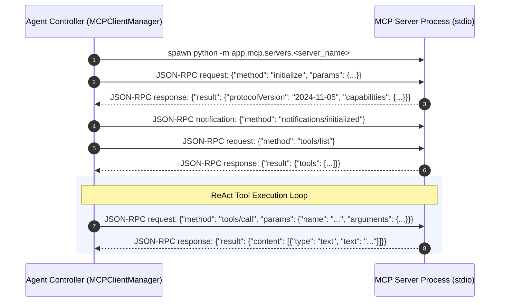

# Model Context Protocol (MCP) Tools Reference

This document provides the complete technical specification for all tools exposed via the **Model Context Protocol (MCP)** JSON-RPC 2.0 stdio servers in the **AI Technical Research Investigator**.

---

## 1. Protocol Architecture & Lifecycle

The agent communicates with local tool servers using the standard **Model Context Protocol (MCP)** over `stdio` subprocess IPC. Each tool server executes as an independent Python process, guaranteeing complete process isolation.



### Stdio Transport Protocol Format
All messages are single-line JSON strings terminated with `\n`:
- **Request Format**:
  ```json
  {"jsonrpc": "2.0", "id": 1, "method": "tools/call", "params": {"name": "inspect_local_repository", "arguments": {"repo_path": "data/sample_project", "action": "inspect_dependencies"}}}
  ```
- **Response Format**:
  ```json
  {"jsonrpc": "2.0", "id": 1, "result": {"content": [{"type": "text", "text": "{\"dependencies\": [\"fastapi>=0.100.0\", \"pydantic>=2.0.0\"], \"manifest_found\": true}"}]}}
  ```

---

## 2. Tool Catalog & Detailed Specifications

### Tool 1: `inspect_local_repository`
* **Server Module**: `app/mcp/servers/repo_server.py`
* **Purpose**: Inspects local files, directories, codebases, and package dependency manifests.

#### Input Parameters
| Parameter | Type | Required | Description |
| :--- | :--- | :--- | :--- |
| `repo_path` | `string` | **Yes** | Path to the target local repository root. |
| `action` | `string` | **Yes** | One of: `list_dir`, `read_file`, `search_code`, `inspect_dependencies`. |
| `target` | `string` | No | Sub-directory path (for `list_dir`), file path (for `read_file`), or search term (for `search_code`). |

#### Actions & Behavior
1. **`list_dir`**: Lists non-hidden files and subdirectories, filtering out noise directories (`__pycache__`, `.venv`, `node_modules`).
2. **`read_file`**: Reads text files safely with UTF-8 decoding and truncates files exceeding 50 KB to preserve token budgets.
3. **`search_code`**: Greps recursively through source files (`.py`, `.js`, `.ts`, `.json`, `.toml`, `.yaml`, `.txt`) for specific classes, functions, or error messages.
4. **`inspect_dependencies`**: Automatically detects and parses `requirements.txt`, `pyproject.toml`, `Pipfile`, or `setup.py`.

#### Output Schema Example (`inspect_dependencies`)
```json
{
  "repo_path": "data/sample_project",
  "action": "inspect_dependencies",
  "manifest_file": "requirements.txt",
  "dependencies": [
    "fastapi>=0.100.0",
    "pydantic>=2.0.0",
    "uvicorn>=0.22.0"
  ],
  "status": "SUCCESS"
}
```

#### Error Codes & Statuses
- `FILE_NOT_FOUND`: Repository path or target file does not exist.
- `NOT_A_DIRECTORY`: Target for directory listing is not a directory.
- `MISSING_ARGUMENT`: Missing required `action` or `target`.

---

### Tool 2: `search_github_issues`
* **Server Module**: `app/mcp/servers/github_server.py`
* **Purpose**: Searches GitHub issues, PRs, and discussions for known bugs, breaking changes, and migration advisories.

#### Input Parameters
| Parameter | Type | Required | Description |
| :--- | :--- | :--- | :--- |
| `query` | `string` | **Yes** | Search terms (e.g., `FastAPI @validator PydanticUserError`). |
| `repo` | `string` | No | Specific repository in `owner/repo` format (e.g., `fastapi/fastapi` or `pydantic/pydantic`). |

#### Features & Fallback Strategy
- Uses GitHub REST API (`https://api.github.com/search/issues`).
- Automatically incorporates optional `GITHUB_TOKEN` from environment if present to increase rate limits.
- If GitHub API is unavailable or rate-limited, falls back to structured web search targeting `github.com/<repo>/issues`.

#### Output Schema Example
```json
{
  "query": "PydanticUserError @validator",
  "total_results": 4,
  "items": [
    {
      "title": "PydanticUserError: `@validator` is removed in Pydantic v2",
      "url": "https://github.com/pydantic/pydantic/issues/6000",
      "state": "closed",
      "body_snippet": "In Pydantic V2, `@validator` is deprecated and replaced by `@field_validator`..."
    }
  ],
  "status": "SUCCESS"
}
```

---

### Tool 3: `search_web`
* **Server Module**: `app/mcp/servers/web_search_server.py`
* **Purpose**: Performs live web research via DuckDuckGo to discover official documentation, release notes, and technical articles.

#### Input Parameters
| Parameter | Type | Required | Description |
| :--- | :--- | :--- | :--- |
| `query` | `string` | **Yes** | Search string for technical documentation or errors. |
| `max_results` | `integer` | No | Number of search results (default: `5`, max: `10`). |

#### Output Schema Example
```json
{
  "query": "Pydantic v2 migration guide field_validator",
  "results_count": 3,
  "results": [
    {
      "title": "Migration Guide - Pydantic Documentation",
      "url": "https://docs.pydantic.dev/latest/migration/",
      "snippet": "Pydantic V2 replaces @validator with @field_validator and @root_validator with @model_validator."
    }
  ],
  "status": "SUCCESS"
}
```

> [!NOTE]
> **Evidence State**: Search engine snippet results are tagged as **`RETRIEVED`** candidate sources. To promote them to **`VERIFIED`** evidence, the agent must fetch the document using `fetch_web_document`.

---

### Tool 4: `fetch_web_document`
* **Server Module**: `app/mcp/servers/web_search_server.py`
* **Purpose**: Downloads and parses main text content from a web URL, converting HTML into clean, readable Markdown text.

#### Input Parameters
| Parameter | Type | Required | Description |
| :--- | :--- | :--- | :--- |
| `url` | `string` | **Yes** | Target web page URL to download and inspect. |

#### Features & Text Extraction
- Uses `BeautifulSoup4` with readability filters (strips `<script>`, `<style>`, `<nav>`, `<footer>`, `<header>`, and ads).
- Converts HTML headings, code blocks, lists, and paragraphs into structured Markdown text.
- Limits output to 8,000 characters to prevent context window overflow while preserving key code snippets.

#### Output Schema Example
```json
{
  "url": "https://docs.pydantic.dev/latest/migration/",
  "title": "Migration Guide - Pydantic Documentation",
  "content_markdown": "## Validators in Pydantic v2\n\nIn V2, `@validator` is replaced by `@field_validator`. Example:\n```python\nfrom pydantic import field_validator\n```",
  "status": "SUCCESS"
}
```

---

## 3. Tool Invocation Safeguards & Runtime Policies

1. **Duplicate Call Prevention**:
   The `MCPClientManager` hashes tool name and arguments. If an identical call succeeded previously in the same investigation, the cached result is returned immediately without spawning redundant subprocesses, incrementing `duplicate_tool_calls_prevented`.

2. **Error Ingestion Guardrail**:
   When an MCP server returns an error payload (e.g. `isError: true` or `status: "FILE_NOT_FOUND"`), the result is **never** admitted as valid evidence. Instead, it increments `failed_mcp_calls` and `error_count` in runtime telemetry.

3. **Security Boundaries**:
   - `repo_server.py` validates path resolution to prevent directory traversal outside allowed roots.
   - External web requests enforce explicit timeout ceilings (10.0s) to prevent hanging agent threads.
